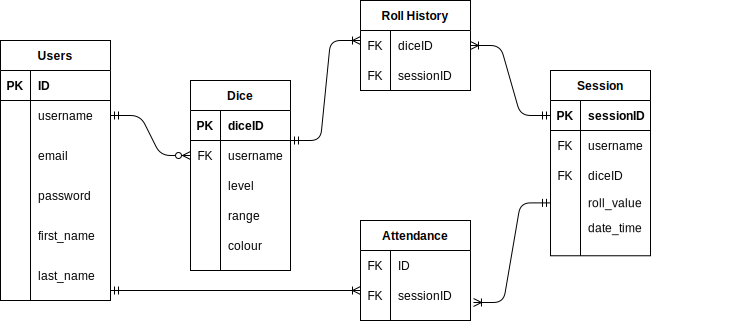
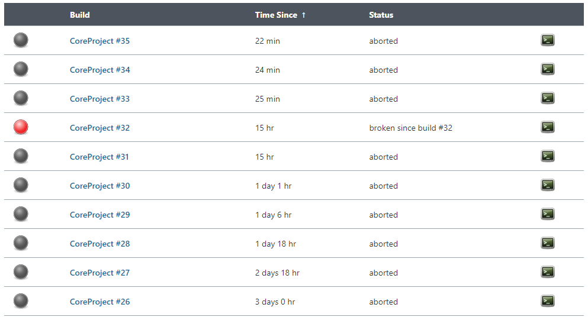

# QA-Core-Fundamental-Project
The fundamental skills project during DevOps training at QA

## Table of contents

- [Objective](#objective)
- [Requirements](#requirements)
    - [Options](#options)
    - [Technology](#technology)
- [Planning](#planning)
- [Architecture](#architecture)
- [Front-End](#front-end)
- [Documentation](#documentation)
    - [Risk Assessment](#risk-assessment)
    - [Testing](#testing)
- [Issues](#issues)
- [Roadmap](#roadmap)
## Objective
To create a CRUD application with utilisation of supporting tools, methodologies and technologies that encapsulate all core modules covered during training.

This project aims to complete the objective as a **ttrpg** dice application.

### Requirements

- Kanban board (Trello)
    - User stories/Use cases/tasks
    - Record of issues or risks
- Relational database (Persistant)
    - At least 2 tables
    - Model a relationship
- Clear documentation
    - Describing architecture
    - Risk assessment
- Functional CRUD application
    - (Create, Read, Update, Delete) functionality
    - Follow best practices and design principles
    - Requirements of Kanban board met
- Test suite designed
    - Automated testing for validation of application
    - High test coverage in the backend
    - Consistent reports and evidence to support TDD (Test Driven Development)
- Front end (Flask)
    - Functioning website front-end
    - Integrated API's
- Version Control System
    - Feature-Branch model followed
    - Code built through a CI server
    - Deployed on a cloud-based Virtual Machine

### Options
- Registration and Login Functionality

### Technology
- Kanban Board
- Database: GCP SQL Server
- Programming language: Python
- Unit testing with Python: Pytest
- Integration testing with Python: Selenium
- Front-end: Flask (HTML)
- Version control: Git
- CI Server: Jenkins
- Cloud server: GCP Compute Engine

## Planning
To view the full Trello board for this project [Click here](https://trello.com/b/Xogn4d4n/devop-core-fundamentals)

## Front-end
The user is greeted with an option to log in or register. CSS was used to highlight individual letter upon hover.

Username, email and password are mandatory fields, first name and last name are optional. The password is saved to the database using bcrypt.

### UML diagrams for database
The original ERD for this project is presented below:

After more thought on the MVP and a better understanding of database design, the ERd was revised to the following:

### Risk Assessment
Truncated risk assessment:

For a full view of the risk assessment:
[Click Here](https://docs.google.com/spreadsheets/d/1WqFukyaTO323GE5MpPM3VZ9UM3vmW91j-5BNtHYZGrc/edit?usp=sharing)

### Testing

#### Unit testing
The coverage of unit testing the application.

#### Integration testing

#### CI Server / Build environment + Artifacts

## Issues
The main issue with the app is a lack of multi-user functionality. A goal for the future is creating a history table that can be accessed and edited by multiple users.